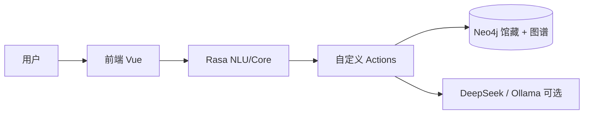

# library_agent

基于 [Rasa](https://rasa.com/) 的中文**图书馆智能对话助手**（演示）：借还书、借阅指引、空间预约、推荐阅读、数据咨询话术、馆规 FAQ 等。

**Neo4j** 中 `:LibraryBook`（`book_key` 唯一）同时承载**馆藏副本**（架位、在架标记）与 **CSV 导入的书目知识**（作者 / 类目 / 主题关系及 `rating`、`summary` 等）；`:BorrowRecord` 记录借阅流水。演示库当前约 **84 册**，含科幻、现当代文学、日本文学、**古典文学**（诗经、楚辞、唐诗宋词、聊斋、儒林外史等，架位 `文学库 C-xx`）等主题。

## 快速开始（Windows + Conda）

### 前置条件

- Python 3.10+（推荐 `conda create -n rasa310 python=3.10`）
- Rasa + rasa-sdk、`neo4j` 驱动等（见 `backend/requirements*.txt`）
- Neo4j（推荐 Aura；本地可用 `scripts/setup_local_neo4j.ps1`，见 `.env.example`）
- Node.js 18+（前端 Vite）
- DeepSeek API Key（可选；本地 Ollama 可选，用于作者介绍等）

### 步骤

1. **配置环境** — 复制 `.env.example` → `.env`，填入 `NEO4J_URI` / `NEO4J_USER`（或 `NEO4J_USERNAME`）/ `NEO4J_PASSWORD`、`DEEPSEEK_API_KEY`（可选）等。

2. **导入演示数据**（首次或清空后，在 `backend/kg_module` 下执行）：

   ```powershell
   conda activate rasa310
   cd backend\kg_module
   python import_data.py --reset
   ```

   将导入 `raw_data/books.csv`（84 册）、`authors.csv`、作者关系与双知识网络。

3. **启动 Action Server**：

   ```powershell
   cd backend
   .\start_actions.ps1
   ```

4. **启动 Rasa**：

   ```powershell
   cd backend
   .\start_rasa.ps1 -RunOnly -Port 5005
   ```

   修改 `rules.yml` / `nlu.yml` / `domain.yml` 后须先 `rasa train` 再重启。

5. **启动前端**：

   ```powershell
   cd front\lib_agent_vue
   npm install
   npm run dev
   ```

   默认 `http://localhost:8080`；侧边栏可配置 Rasa Webhook 地址。

### 验证建议

| 场景 | 示例口令 |
|------|----------|
| 借书 / 还书 | `借书` → 书目表选书 → 填写借阅信息批量提交 |
| 推荐阅读 | `推荐一些古典文学` / `推荐一些日本文学` |
| 单书介绍 | `介绍一下三体` |
| 作者介绍 | `介绍一下刘慈欣` |
| 调试 | 左侧「🛠️ 调试工具」查看知识网络示例与会话状态 |

> **重要提醒**
>
> - 修改 `actions.py`、`neo4j_library_store.py`、`graph_networks.py` 后须**重启 Action Server**。
> - 修改 `rules.yml` / `nlu.yml` / `domain.yml` 后须 **`rasa train`** 并重启 Rasa API。
> - 借还异常（反复「我不太明白」）时：前端会自动 `tracker restart`；亦可执行 `localStorage.removeItem('rasa_sender_id')` 后刷新页面换新会话。

## 项目简介

- **对话层**：Rasa NLU + 规则策略，借还书表单、推荐阅读、FAQ、空间预约等多轮流程。
- **数据层**：Neo4j 馆藏状态、借阅流水、书目图谱（作者关系 + 学科网络）。
- **前端**：Vue 3 + Vite；固定视口布局，**仅对话区滚动**；聊天与调试页隔离；批量借还支持 `borrow_profile` / `return_profile` metadata 直办。
- **推荐阅读**：Action 下发 `reading_recommend` 结构化载荷（图谱补充 + 非馆藏延伸阅读）；**书籍总览**为 `overview_catalog` 分页气泡；**单书介绍** `book_introduce` 聚合馆藏与图谱并可走 DeepSeek。
- **生成式边界**：借还、额度、在架状态以规则 + 数据库为准；DeepSeek / Ollama 仅用于说明性话术与扩展推荐，失败时回退模板。

## 系统架构（简图）



### 分层职责

| 层次 | 职责 | 落点 |
|------|------|------|
| 交互与表示 | 消息、书目表、批量借还表单 | `front/lib_agent_vue` |
| 对话编排 | 意图、表单、规则、兜底 | `backend/data/`、`domain.yml` |
| 业务与数据 | 流通、检索、图谱、导入 | `actions/`、`kg_module/` |

## 目录结构

```text
library_agent/
├── backend/                 # Rasa、Action、kg_module、NLU 数据
│   ├── actions/             # 自定义 Action（借还、推荐、GraphRAG 等）
│   ├── kg_module/raw_data/  # books.csv、authors.csv、author_relations.csv
│   └── data/                # nlu.yml、rules.yml、stories.yml
├── deploy/                  # Docker Compose
├── docs/                    # 操作指引、图谱本体、扩展路线
├── front/lib_agent_vue/     # Vue 聊天页
├── scripts/                 # 本地 Neo4j / WSL2 辅助脚本
├── .env.example
└── README.md
```

| 文档 | 说明 |
|------|------|
| [docs/README.md](docs/README.md) | 文档总索引 |
| [docs/操作指引.md](docs/操作指引.md) | 环境、启动、排障 |
| [docs/kg_ontology_v2.md](docs/kg_ontology_v2.md) | 图谱本体与双知识网络 |

**容器部署**：`docker compose -f deploy/docker-compose.yml up --build`（需先配置 `.env`）。

**远程仓库**：`git@github.com:Si-Nan-Si-Mu/library_agent.git`

---

## 更新记录

**维护约定**：影响功能或配置的合并在本表**顶部**追加一行（`YYYY-MM-DD` + 摘要）。

| 日期 | 摘要 |
|------|------|
| 2026-06-11 | **借还会话修复**：批量借还经 metadata 直办；修正表单 `ignored_intents` 与 rules，避免 `action_execution_rejected` 卡死；前端 tracker `restart` 与索书号提交。**馆藏扩充**：新增 21 本古典文学（`KG.GR.00064`–`084`）、`authors.csv` 与作者关系边；古典文学主题检索扩展。**前端**：推荐阅读移除「本馆馆藏」表；固定视口、仅对话区滚动；侧边栏与主区对齐。**适配**：`llm_server` / `neo4j_connector` 作者介绍、Neo4j 鉴权兼容 `NEO4J_USERNAME`、本地 Neo4j 脚本。 |
| 2026-06-10 | **双知识网络**：作者关系（`author_relations.csv`）+ 学科网络（`Discipline` / `WORKS_IN` 等）；`graph_networks.py` 导入与派生边。**前端**：侧边栏聊天/调试隔离；调试页知识网络可视化。**推荐阅读**：主题纠偏、图谱扩展去重。 |
| 2026-05-13 | **书籍总览** `overview_catalog` 分页；**单书介绍** `book_introduce`；借还确认 `deny` 规则与清槽。 |
| 2026-05-12 | 文档索引与 Vite 迁移；推荐阅读 Markdown 分节表；`nlu.yml` 主题例句优化。 |
| 2026-05-09 | 馆藏与流通迁入 Neo4j，移除 SQLite。 |

更早记录见 Git 历史或 [docs/图书馆智能助手改造说明.md](docs/图书馆智能助手改造说明.md)。
