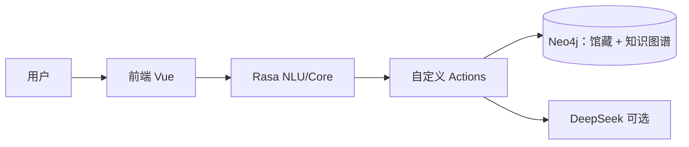

# library_agent

基于 [Rasa](https://rasa.com/) 的中文**图书馆智能对话助手**（演示）：借还书、借阅指引、空间预约、推荐阅读、数据咨询话术、馆规 FAQ 等；**Neo4j** 中 `:LibraryBook`（`book_key` 唯一）同时承载**馆藏副本**（架位、在架标记）与 **CSV 导入的书目知识**（作者/类目/主题关系及 `rating`、`summary` 等），`:BorrowRecord` 记录借阅流水。

## 快速开始（Windows + Conda）

### 前置条件
- Python 3.10+（推荐 `conda create -n rasa310 python=3.10`）
- 已安装 Rasa + rasa-sdk、`neo4j` 驱动、`markdown-it-py`、`DOMPurify` 等（见 `backend/requirements*.txt`）
- Neo4j 实例（推荐 Aura；本地需配置 `.env` 中的 `NEO4J_URI` / `NEO4J_USER` / `NEO4J_PASSWORD`）
- Node.js 18+（前端 Vite）
- DeepSeek API Key（可选，用于推荐阅读 / data_inquiry 生成式增强）

### 步骤
1. **配置环境**  
   复制 `.env.example` → `.env`，填入 `NEO4J_*`、`DEEPSEEK_API_KEY`（可选）、Rasa 端口等。

2. **启动 Action Server**（含 Neo4j 知识网络构建）  
   ```powershell
   conda activate rasa310
   cd backend
   .\start_actions.ps1
   ```
   首次或清空后需执行：`python kg_module/import_data.py --reset`（自动构建作者关系 + 学科网络）。

3. **启动 Rasa**  
   ```powershell
   cd backend
   .\start_rasa.ps1 -RunOnly -Port 5005
   ```
   修改 NLU / rules / domain 后务必先 `rasa train`。

4. **启动前端**  
   ```powershell
   cd front\lib_agent_vue
   npm install
   npm run dev   # 默认 http://localhost:8080
   ```

5. **验证**  
   - 聊天页测试借还、推荐阅读（「推荐一些日本文学」应返回学科 + 作者关系 hint）。
   - 切换左侧「🛠️ 调试工具」查看 Neo4j 知识网络可视化示例、会话状态与常用命令。

> **重要提醒**
> - 修改 `actions.py`、`neo4j_graph.py`、`graph_networks.py` 后必须**重启 Action + Rasa**。
> - 修改 `rules.yml` / `nlu.yml` 后先 `rasa train` 再重启。
> - 清空 Neo4j 后恢复演示数据：`python kg_module/import_data.py --reset`。

## 项目简介

- 后端基于 `Rasa + rasa-sdk`，实现借书、还书、空间预约、FAQ、推荐阅读等多轮对话。
- 数据层使用 **Neo4j**：馆藏在架/已借状态、借阅流水与基础书目检索均由图数据库维护（需配置 `NEO4J_*`，见 `.env.example`）。
- 前端为 **Vue 3 + Vite** 聊天页，通过 REST webhook 对接 `Rasa API`。
- 当前定位为演示与联调工程，可逐步扩展到真实 OPAC/流通/预约系统。
- DeepSeek 用于 `data_inquiry` 与 GraphRAG（NL2Cypher）等场景的生成式说明；**推荐阅读**由 Action 下发 `reading_recommend` 结构化载荷（Neo4j 馆藏 + 图谱扩展），Vue 以**分节表格**展示；**书籍总览**为 `overview_catalog` 宽气泡（Neo4j 按页查询、已访问页前端缓存、内部翻页意图 `book_overview_pager`）；**单书介绍**意图 `book_introduce` 由 `action_book_introduce` 聚合馆藏与图谱事实并可选 DeepSeek 导读；借还书等主流程由规则 + Neo4j 数据驱动。
- 前端对普通 `text` 回复合并为单条气泡，并在等待 Rasa 时显示「查询中 / 思考中 / 回复中」占位（`App.vue`）。

## 系统架构与智能体界定

本仓库面向课程与演示，在工程上采用**分层、模块化**结构：将「自然语言理解与多轮对话」与「图书馆业务执行」在**职责**上分离，在**数据与规则**上共享同一套后端能力，避免重复实现与状态不一致。

### 分层职责（从用户到数据）

| 层次 | 主要职责 | 本仓库中的落点（示例） |
| ---- | -------- | ---------------------- |
| **交互与表示** | 统一入口、消息展示、结构化辅助（检索结果、确认借还等） | `front/lib_agent_vue` 与 Rasa REST/Webhook |
| **对话编排** | 意图识别、槽位/表单、故事与规则、异常与兜底 | `backend` 下 NLU、Core、`domain.yml`、自定义 Action 入口 |
| **业务与数据** | 书目状态、借阅额度、流水写入、图谱与检索 | `backend/actions/neo4j_library_store.py`、`neo4j_graph.py`、`kg_module` |

借书、还书等流程可以**由对话触发**（表单填槽 → Action 校验 → 写库），也可以配合前端的**列表、模态框、序号选择**等结构化交互完成；二者应调用**同一套**业务逻辑（本项目通过 Rasa Action 与 Neo4j 书目/流通子图体现）。这种拆分符合常见软件实践：**对话负责「理解与引导」，业务模块负责「可测试、可审计的执行」**。

### 为何仍可将本系统称为「智能体」

在人工智能导论等课程语境下，**智能体**通常强调具备对环境的**感知**、基于策略的**决策**，以及对外部能力的**行动**（含多轮交互）。本系统的对话层持续接收用户自然语言与上下文，通过 NLU/Core 选择意图与跳转流程，并调用数据库查询、推荐与（可选）大模型生成等**外部能力**，形成「感知—决策—行动」闭环。

将借还、预约等实现为**独立、可复用的模块**（相对对话脚本而言），并不削弱「智能体」属性，而对应研究与应用中的常见范式：**工具使用（tool use）或子系统委托**——对话智能体作为**编排者（orchestrator）**，在明确用户目标后调用可靠子模块完成状态变更。若未来接入真实 OPAC/ILS，同样适合保持「对话编排 + 流通 API」的边界，而非把全部业务规则堆在单一聊天脚本中。

### 生成式能力的边界（与确定性流程区分）

为便于报告撰写与运维说明，建议明确区分：

- **确定性主流程**：借还校验、在架状态、额度与表单逻辑，以规则与数据库为准，便于回归测试与演示复现。
- **生成式增强**：如 `data_inquiry` 等场景使用 DeepSeek 生成说明性话术；失败或无密钥时回退固定模板，避免影响借还等关键路径。

这样既满足课程对「智能」的展示（语言理解、多轮、工具调用、可选生成），又符合软件工程对**正确性敏感模块**的约束方式。

### 架构示意（逻辑视图）



## 目录结构（简版）

```text
library_agent/
├── backend/                 # Rasa、Action、Neo4j 导入与 NLU 数据
├── deploy/                  # Docker Compose
├── docs/                    # 文档总索引见 docs/README.md
├── front/lib_agent_vue/     # Vue + Vite 聊天页
├── sql/                     # （可选）SQL 注释脚本
├── .env.example
└── README.md                # 项目入口与更新记录
```

| 文档 | 说明 |
| ---- | ---- |
| [**docs/README.md**](docs/README.md) | **文档总索引**（操作指引、改造说明、图谱本体、扩展路线、CrossWOZ） |
| [**docs/操作指引.md**](docs/操作指引.md) | Windows + Conda、Rasa / Action / Vue、Webhook、常见问题 |
| [**docs/图书馆智能助手改造说明.md**](docs/图书馆智能助手改造说明.md) | 领域改造、完成状态、对接清单 |

**知识图谱与馆藏**：`backend/kg_module/`、`backend/actions/neo4j_library_store.py`、`backend/actions/neo4j_graph.py`；未配置 `NEO4J_*` 时借还与推荐阅读不可用。本体见 [docs/kg_ontology_v2.md](docs/kg_ontology_v2.md)。扩展路线见 [docs/扩展路线与环境.md](docs/扩展路线与环境.md)。

**容器部署**：复制 `.env.example` 为 `.env` 后执行 `docker compose -f deploy/docker-compose.yml up --build`。

**远程仓库**：`git@github.com:Si-Nan-Si-Mu/library_agent.git`

---

## 更新记录

**维护约定**：凡影响功能、配置或文档结构的合并，在本表**顶部**追加一行（`YYYY-MM-DD` + 一句话摘要）；细则见 [docs/图书馆智能助手改造说明.md](docs/图书馆智能助手改造说明.md) 文末 **「维护约定」**。纯错别字或无关格式微调可不记。

| 日期 | 摘要 |
| ---- | ---- |
| 2026-06-10 | **双知识网络**：新增作者关系网络（`author_relations.csv` + `INFLUENCED`/`CONTEMPORARY_WITH`/`RIVAL_OF`）与学科网络（`Discipline` + `IN_DISCIPLINE`/`WORKS_IN`/`UNDER_DISCIPLINE`）；`graph_networks.py` 实现 CSV 导入 + 派生边；`schema_cypher.py` 增加唯一约束、`prompt_templates.py` 更新 GraphRAG Schema、`neo4j_graph.py` 支持学科检索与 `related_authors`、`actions.py` 推荐阅读 hint 展示学科/关联作者。**前端重构**：左侧侧边栏导航（聊天 / 调试工具）；调试页**完全隔离**聊天（`v-if` 控制 `chat-list` 与 `composer`）；新增 Neo4j 知识网络可视化卡片（学科 pill、作者关系表、迷你图预览）、会话状态展示、常用命令提示；`sendQuickTest` 移除。**推荐阅读优化**：主题纠偏（「日本文学」）、图谱扩展去重与 DeepSeek 简介。**文档**：`kg_ontology_v2.md` v2.1 双网络完整说明、`操作指引.md` 更新导入与知识网络流程。 |
| 2026-05-13 | **书籍总览**：`overview_catalog` 气泡 + Neo4j 分页（`get_library_collection_stats` / `list_on_shelf_overview_page`）；`book_overview_pager` 内部翻页；Vue **已访问页缓存**（返回上一页不请求、无加载层）、修正翻页后加载态残留；`nlu.yml` 与 `intent_retrieval_kb.json` 增补馆藏总览错别字与口语。**单书介绍**：新意图 `book_introduce`、`action_book_introduce`（馆藏 JSON + 图谱 + DeepSeek，`BOOK_INTRO_DEEPSEEK` / `.env.example`）。**借还体验**：表单不再忽略 `reading_recommend` 等以便打断；确认阶段 `deny` 规则与 `action_borrow_confirm_cancel` / `action_return_confirm_cancel` 清槽；`nlu.yml` 增补「否」等。**工程**：Neo4j 馆藏脚本与 Vite 前端迁移、根目录 `package.json` 等合并。**文档**：`操作指引` 增补总览气泡与单书介绍排障。 |
| 2026-05-12 | **文档**：`docs/README.md` 为总索引；新增 `扩展路线与环境.md`、`CrossWOZ语料说明.md`；删 `README_v2.md`、`backend/docs/ontology_v2.md`；子项目 README 指向 `docs/`。**前端**：`lib_agent_vue` 迁 **Vite 5 + Vue 3.5**；机器人/书目表/推荐阅读等 **Markdown**（`markdown-it` + DOMPurify）；扩展推荐表去掉位置/状态列、图谱简介可走 DeepSeek（`READING_GRAPH_INTRO_DEEPSEEK`）；`jsconfig.json` 收敛 TS 服务对 `@types` 的误解析。**后端**：推荐阅读主导读强制 Markdown 排版；`_deepseek_multi_intent_system` 修复；`nlu.yml` 增加短主题例、将 `borrow_book` 中「人工智能相关书」改为「我要借…」减轻与 `reading_recommend` 冲突。 |
| 2026-05-09 | 移除 SQLite：`library_db` 与 `sql/library_book_sqlite.sql` 删除；馆藏书目与流通迁入 Neo4j（`neo4j_library_store.py`，`:LibraryBook`、`:BorrowRecord`）；GraphRAG 提示扩展馆藏模型。 |
| 2026-05-05 | 推荐阅读改为 `reading_recommend` 结构化载荷 + Vue 分节表格；`library_db` 主题检索扩展/排序与演示种子增补；前端合并多段文本、等待态与宽气泡样式；同步 README/操作指引说明。 |
| 2026-05-05 | README 增补「系统架构与智能体界定」：分层职责、工具调用式智能体说明、生成式边界与逻辑架构图。 |
| 2026-04-24 | 删除已合并的 `library_rag_backend/` 快照目录，并移除 `rag-rasa` 远程；图谱与 RAG 能力以 `backend/kg_module` 为准。 |
| 2026-04-24 | 文档统一：补充「快速开始」「Action 代码变更需重启双服务」与 DeepSeek 适用边界说明；操作指引新增推荐后借第 N 本与相关排障。 |
| 2026-04-24 | 文档：`docs/操作指引.md` 移除「轻量静态页」并顺延章节；Docker 节补充本机未安装 `docker` 时的说明。 |
| 2026-04-24 | 完全合并 `backend/library-RAG-Rasa-main`：`kg_module`（CSV 导入、Schema）、`neo4j_graph` 与 `reading_recommend` 图谱优先；`docs/kg_ontology_v2.md`；Compose 增加 Neo4j；依赖增加 `neo4j`；删除嵌套目录。 |
| 2026-04-24 | 接入 DeepSeek API：`data_inquiry` 走 `action_data_inquiry`（无密钥或失败时回退 `utter_data_inquiry`）；新增 `deploy/docker-compose.yml`、双阶段 Dockerfile、`backend/endpoints.docker.yml`、`.env.example` 与 `requirements-*.txt`。合并后请 `rasa train` 并重启 Action + API。 |
| 2026-04-13 | 语义纠偏：新增借还/预约/FAQ 对抗样本与口语短句；优化“咨询 vs 办理”“总览 vs 推荐”等易混淆边界，连续多轮扩充 `nlu.yml` 并通过数据校验。 |
| 2026-04-13 | 借还鲁棒性增强：`actions.py` 对输入书名做归一化提取（支持 `《书名》`、整行书目信息粘贴、去除架位/索书号噪声），并下调 `FallbackClassifier.threshold` 至 `0.35` 以减少误兜底。 |
| 2026-04-13 | 继续优化语义识别：补充 `space_booking` 的 `time_slot` 实体样本，缓解训练告警；新增序号选书（如「第2本」「1」）的回归测试故事。 |
| 2026-04-13 | 借还书多条候选选择支持「索书号或序号」（如 `1`/`第2本`）；扩充借还确认口语语料与索书号正则，降低 `nlu_fallback` 误触发。需 `rasa train` 并重启 API + Action。 |
| 2026-04-13 | 借还表单：移除 `ignored_intents` 中的 `nlu_fallback`，并为 `book_title`/`call_number` 增加 `from_text` 条件映射，避免纯数字索书号退出表单。需 `rasa train` 并重启 API。 |
| 2026-04-13 | SQLite 书目库自动补全至 ≥120 条；`borrow_book`/`return_book` 区分未找到/已借出/在架；借还确认前 `lookup_circulation` 查询；结果写入 `last_borrow_detail`/`last_return_detail`。需重启 Action；已有 `library.db` 会在连接时自动补行。 |
| 2026-04-11 | chore: 合并提交对话与文档（`action_deactivate_loop` 规则与故事、表单 NLU/lookup、预约槽位校验、`nlu_fallback` 条件、InvalidRule 修复、操作指引与改造说明）。 |
| 2026-04-11 | 修复 `action_deactivate_loop` 404：从 `domain.yml` 的 `actions` 列表移除（内置动作勿写入该列表，否则会被误发到 Action Server）。`rasa train` 后重启 API 即可。 |
| 2026-04-11 | 预约填槽：仅当无活跃表单时触发 `nlu_fallback` 兜底；`room_type` lookup + NLU 例句；`validate_space_booking_form` 从原文归一化「研讨室」等。需 `rasa train` 并重启 Action。 |
| 2026-04-11 | 修复 `InvalidRule`：`rules.yml` 中三条「激活*表单」去掉首步 `action_deactivate_loop`，与 `stories.yml` 对齐；`greet`/`goodbye` 故事补上 `action_deactivate_loop` 与问候规则一致；`tests/test_stories.yml` 同步。 |
| 2026-04-11 | 修复双气泡与「预约」进兜底：`rules.yml` 在问候/FAQ/兜底及三表单激活前增加 `action_deactivate_loop`；`nlu.yml` 为 `space_booking` 补充单字「预约」等例句。需 `rasa train` 并重启 API。 |
| 2026-04-11 | 《改造说明》§2 对话与数据层：增加文件总览表与各文件优化清单；扩充 `nlu.yml` 例句、`dict.txt`、`test_stories.yml`。合并后请 `rasa train`。 |
| 2026-04-11 | 修复「每条回复后重复追问预约空间」：`domain.yml` 为各表单增加 `ignored_intents`，并调整 `session_config`（避免会话与表单状态无限期占用同一 sender）。需 `rasa train` 后重启 API。 |
| 2026-04-11 | 仓库结构重组：`backend` 承载 Rasa、Vue 前端与 `sql/` 脚本；忽略 `.rasa/`、`models/*.tar.gz`、`data/library.db`；`git push --force-with-lease` 同步至 `origin/main`。 |
| 2026-04-11 | 《改造说明》增加完成状态总览、分节 ✅/⏳/⬜ 与维护约定；根 README 增加本节「更新记录」并链向改造说明中的约定。 |
