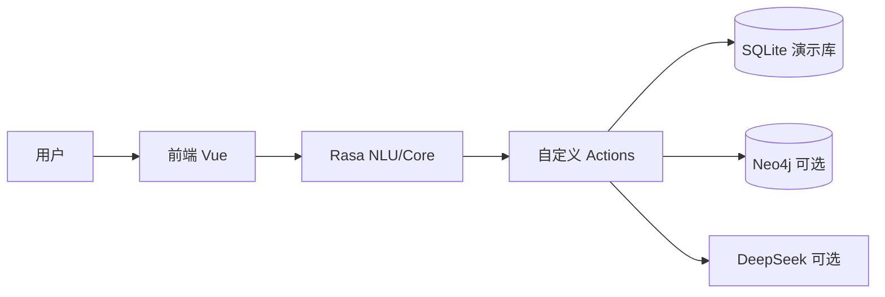

# library_agent

基于 [Rasa](https://rasa.com/) 的中文**图书馆智能对话助手**（演示）：借还书、借阅指引、空间预约、推荐阅读、数据咨询话术、馆规 FAQ 等；书目借还与推荐阅读使用 **SQLite** 演示库（见 `backend/actions/library_db.py`）。

## 快速开始（Windows）

1. 启动 Action：`backend\start_actions.ps1`
2. 启动 Rasa：`backend\start_rasa.ps1 -RunOnly -Port 5005`
3. 启动前端：`front\lib_agent_vue` 下 `pnpm serve`

> 重要：修改 `backend/actions/actions.py` 后，需**重启 Action + Rasa**；仅重启 Rasa 不会加载新的 Action 代码。

## 项目简介

- 后端基于 `Rasa + rasa-sdk`，实现借书、还书、空间预约、FAQ、推荐阅读等多轮对话。
- 数据层使用 `SQLite` 演示库，支持在架/已借状态切换与基础书目检索。
- 前端为 Vue 聊天页，通过 REST webhook 对接 `Rasa API`。
- 当前定位为演示与联调工程，可逐步扩展到真实 OPAC/流通/预约系统。
- DeepSeek 仅用于 `data_inquiry` 场景的生成式说明；借还书、推荐阅读、书籍总览等主流程由规则 + SQLite/Neo4j 数据驱动。

## 系统架构与智能体界定

本仓库面向课程与演示，在工程上采用**分层、模块化**结构：将「自然语言理解与多轮对话」与「图书馆业务执行」在**职责**上分离，在**数据与规则**上共享同一套后端能力，避免重复实现与状态不一致。

### 分层职责（从用户到数据）

| 层次 | 主要职责 | 本仓库中的落点（示例） |
| ---- | -------- | ---------------------- |
| **交互与表示** | 统一入口、消息展示、结构化辅助（检索结果、确认借还等） | `front/lib_agent_vue` 与 Rasa REST/Webhook |
| **对话编排** | 意图识别、槽位/表单、故事与规则、异常与兜底 | `backend` 下 NLU、Core、`domain.yml`、自定义 Action 入口 |
| **业务与数据** | 书目状态、借阅额度、流水写入、图谱与检索 | `backend/actions/library_db.py`、`borrow_record` 等；可选 `neo4j_graph.py` / `kg_module` |

借书、还书等流程可以**由对话触发**（表单填槽 → Action 校验 → 写库），也可以配合前端的**列表、模态框、序号选择**等结构化交互完成；二者应调用**同一套**业务逻辑（本项目通过 Rasa Action 与 SQLite 演示库体现）。这种拆分符合常见软件实践：**对话负责「理解与引导」，业务模块负责「可测试、可审计的执行」**。

### 为何仍可将本系统称为「智能体」

在人工智能导论等课程语境下，**智能体**通常强调具备对环境的**感知**、基于策略的**决策**，以及对外部能力的**行动**（含多轮交互）。本系统的对话层持续接收用户自然语言与上下文，通过 NLU/Core 选择意图与跳转流程，并调用数据库查询、推荐与（可选）大模型生成等**外部能力**，形成「感知—决策—行动」闭环。

将借还、预约等实现为**独立、可复用的模块**（相对对话脚本而言），并不削弱「智能体」属性，而对应研究与应用中的常见范式：**工具使用（tool use）或子系统委托**——对话智能体作为**编排者（orchestrator）**，在明确用户目标后调用可靠子模块完成状态变更。若未来接入真实 OPAC/ILS，同样适合保持「对话编排 + 流通 API」的边界，而非把全部业务规则堆在单一聊天脚本中。

### 生成式能力的边界（与确定性流程区分）

为便于报告撰写与运维说明，建议明确区分：

- **确定性主流程**：借还校验、在架状态、额度与表单逻辑，以规则与数据库为准，便于回归测试与演示复现。
- **生成式增强**：如 `data_inquiry` 等场景使用 DeepSeek 生成说明性话术；失败或无密钥时回退固定模板，避免影响借还等关键路径。

这样既满足课程对「智能」的展示（语言理解、多轮、工具调用、可选生成），又符合软件工程对**正确性敏感模块**的约束方式。

### 架构示意（逻辑视图）



## 目录结构（简版）

```text
library_agent/
├── backend/                 # Rasa 工程（domain/data/actions/config）
│   ├── actions/             # 自定义 Action、SQLite、Neo4j 图谱查询
│   ├── kg_module/           # Neo4j 约束与 CSV 导入（GraphRAG 数据层）
│   ├── data/                # NLU、rules、stories、responses、词典
│   ├── tests/               # 对话回归测试数据
│   ├── config.yml           # NLU pipeline 与 policy
│   ├── domain.yml           # 意图/实体/槽位/表单/回复
│   └── start_*.ps1          # Windows 启动脚本（Rasa/Action）
├── deploy/                  # Docker Compose + Rasa / Action 镜像构建
├── front/lib_agent_vue/     # Vue 对话前端
├── docs/                    # 操作指引、改造说明
├── sql/                     # SQLite / MySQL 参考脚本
├── .env.example             # DeepSeek 等环境变量示例（复制为 .env）
└── README.md                # 项目入口文档
```

| 文档 | 说明 |
| ---- | ---- |
| [**docs/操作指引.md**](docs/操作指引.md) | Windows + Conda、双终端启动 Rasa / Action、Vue 与 Webhook、常见问题 |
| [**docs/图书馆智能助手改造说明.md**](docs/图书馆智能助手改造说明.md) | 领域改造、**已完成/未完成**标注、外部系统对接与产品化清单 |

扩展路线（Neo4j / GraphRAG 等）见 [**README_v2.md**](README_v2.md)。

**知识图谱（主工程 `backend/`）**：`backend/kg_module/`（CSV 导入、Schema）、`backend/actions/neo4j_graph.py`；`reading_recommend` 在配置 `NEO4J_PASSWORD` 时优先查 Neo4j，否则仍用 SQLite。本体规划见 [docs/kg_ontology_v2.md](docs/kg_ontology_v2.md)。

**容器部署**：仓库根目录复制 `.env.example` 为 `.env` 并填写 `DEEPSEEK_API_KEY` 后，执行 `docker compose -f deploy/docker-compose.yml up --build`。Rasa 使用 `backend/endpoints.docker.yml` 连接名为 `actions` 的服务；未配置密钥时「数据类咨询」仍回退为固定话术。

**远程仓库**：`git@github.com:Si-Nan-Si-Mu/library_agent.git`

---

## 更新记录

**维护约定**：凡影响功能、配置或文档结构的合并，在本表**顶部**追加一行（`YYYY-MM-DD` + 一句话摘要）；细则见 [docs/图书馆智能助手改造说明.md](docs/图书馆智能助手改造说明.md) 文末 **「维护约定」**。纯错别字或无关格式微调可不记。

| 日期 | 摘要 |
| ---- | ---- |
| 2026-05-05 | README 增补「系统架构与智能体界定」：分层职责、工具调用式智能体说明、生成式边界与逻辑架构图。 |
| 2026-04-24 | 删除已合并的 `library_rag_backend/` 快照目录，并移除 `rag-rasa` 远程；图谱与 RAG 能力以 `backend/kg_module` 为准。 |
| 2026-04-24 | 文档统一：补充「快速开始」「Action 代码变更需重启双服务」与 DeepSeek 适用边界说明；操作指引新增推荐后借第 N 本与相关排障。 |
| 2026-04-24 | 文档：`docs/操作指引.md` 移除「轻量静态页」并顺延章节；Docker 节补充本机未安装 `docker` 时的说明。 |
| 2026-04-24 | 完全合并 `backend/library-RAG-Rasa-main`：`kg_module`（CSV 导入、Schema）、`neo4j_graph` 与 `reading_recommend` 图谱优先；`docs/kg_ontology_v2.md`；Compose 增加 Neo4j；依赖增加 `neo4j`；删除嵌套目录。 |
| 2026-04-24 | 接入 DeepSeek API：`data_inquiry` 走 `action_data_inquiry`（无密钥或失败时回退 `utter_data_inquiry`）；新增 `deploy/docker-compose.yml`、双阶段 Dockerfile、`backend/endpoints.docker.yml`、`.env.example` 与 `requirements-*.txt`。合并后请 `rasa train` 并重启 Action + API。 |
| 2026-04-13 | 语义纠偏：新增借还/预约/FAQ 对抗样本与口语短句；优化“咨询 vs 办理”“总览 vs 推荐”等易混淆边界，连续多轮扩充 `nlu.yml` 并通过数据校验。 |
| 2026-04-13 | 借还鲁棒性增强：`actions.py` 对输入书名做归一化提取（支持 `《书名》`、整行书目信息粘贴、去除架位/索书号噪声），并下调 `FallbackClassifier.threshold` 至 `0.35` 以减少误兜底。 |
| 2026-04-13 | 继续优化语义识别：补充 `space_booking` 的 `time_slot` 实体样本，缓解训练告警；新增序号选书（如「第2本」「1」）的回归测试故事。 |
| 2026-04-13 | 借还书多条候选选择支持「索书号或序号」（如 `1`/`第2本`）；扩充借还确认口语语料与索书号正则，降低 `nlu_fallback` 误触发。需 `rasa train` 并重启 API + Action。 |
| 2026-04-13 | 借还表单：移除 `ignored_intents` 中的 `nlu_fallback`，并为 `book_title`/`call_number` 增加 `from_text` 条件映射，避免纯数字索书号退出表单。需 `rasa train` 并重启 API。 |
| 2026-04-13 | SQLite 书目库自动补全至 ≥120 条；`borrow_book`/`return_book` 区分未找到/已借出/在架；借还确认前 `lookup_circulation` 查询；结果写入 `last_borrow_detail`/`last_return_detail`。需重启 Action；已有 `library.db` 会在连接时自动补行。 |
| 2026-04-11 | chore: 合并提交对话与文档（`action_deactivate_loop` 规则与故事、表单 NLU/lookup、预约槽位校验、`nlu_fallback` 条件、InvalidRule 修复、操作指引与改造说明）。 |
| 2026-04-11 | 修复 `action_deactivate_loop` 404：从 `domain.yml` 的 `actions` 列表移除（内置动作勿写入该列表，否则会被误发到 Action Server）。`rasa train` 后重启 API 即可。 |
| 2026-04-11 | 预约填槽：仅当无活跃表单时触发 `nlu_fallback` 兜底；`room_type` lookup + NLU 例句；`validate_space_booking_form` 从原文归一化「研讨室」等。需 `rasa train` 并重启 Action。 |
| 2026-04-11 | 修复 `InvalidRule`：`rules.yml` 中三条「激活*表单」去掉首步 `action_deactivate_loop`，与 `stories.yml` 对齐；`greet`/`goodbye` 故事补上 `action_deactivate_loop` 与问候规则一致；`tests/test_stories.yml` 同步。 |
| 2026-04-11 | 修复双气泡与「预约」进兜底：`rules.yml` 在问候/FAQ/兜底及三表单激活前增加 `action_deactivate_loop`；`nlu.yml` 为 `space_booking` 补充单字「预约」等例句。需 `rasa train` 并重启 API。 |
| 2026-04-11 | 《改造说明》§2 对话与数据层：增加文件总览表与各文件优化清单；扩充 `nlu.yml` 例句、`dict.txt`、`test_stories.yml`。合并后请 `rasa train`。 |
| 2026-04-11 | 修复「每条回复后重复追问预约空间」：`domain.yml` 为各表单增加 `ignored_intents`，并调整 `session_config`（避免会话与表单状态无限期占用同一 sender）。需 `rasa train` 后重启 API。 |
| 2026-04-11 | 仓库结构重组：`backend` 承载 Rasa、Vue 前端与 `sql/` 脚本；忽略 `.rasa/`、`models/*.tar.gz`、`data/library.db`；`git push --force-with-lease` 同步至 `origin/main`。 |
| 2026-04-11 | 《改造说明》增加完成状态总览、分节 ✅/⏳/⬜ 与维护约定；根 README 增加本节「更新记录」并链向改造说明中的约定。 |
